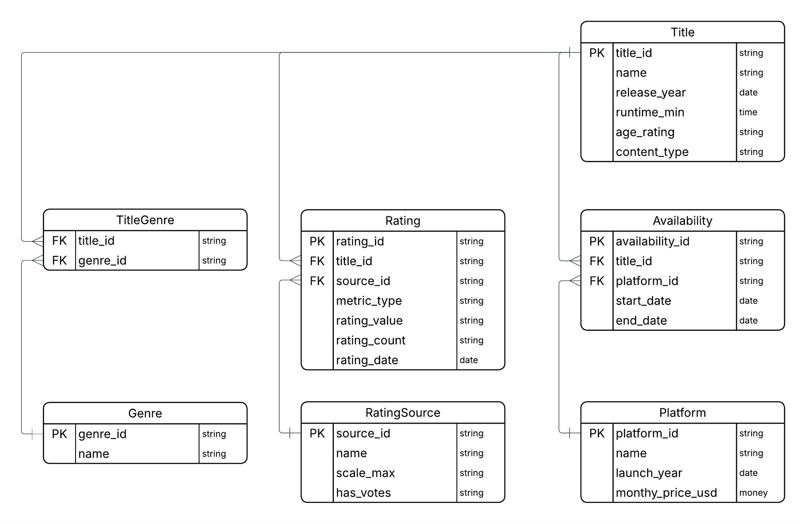
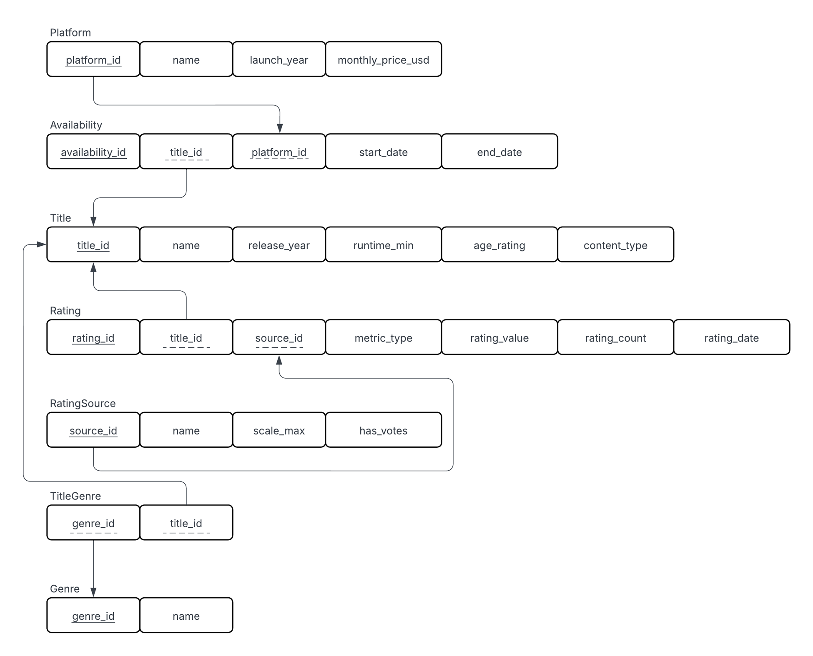
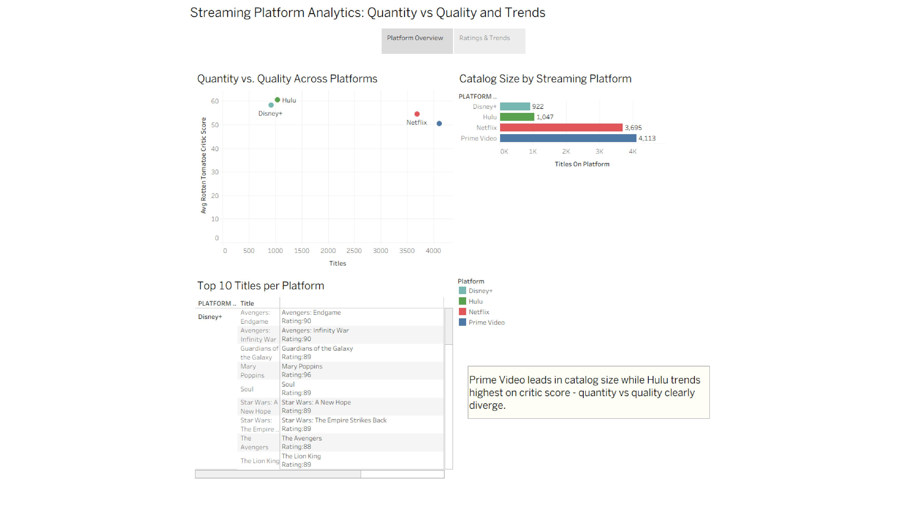
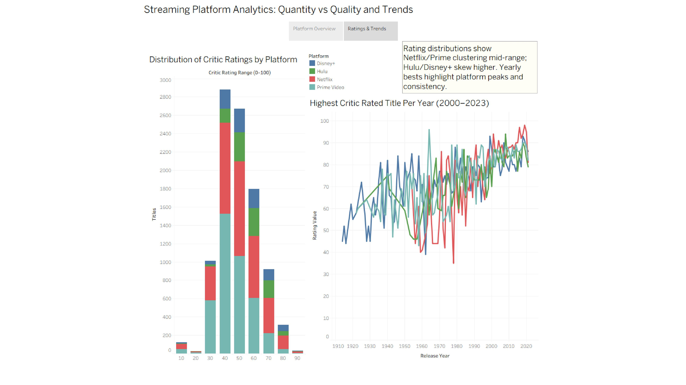

# Streaming Platform Analytics

Analyze movie availability and ratings across Netflix, Hulu, Prime Video, and Disney+ with a normalized relational schema, reproducible SQL, and demo analytics. Includes ready-to-publish Tableau dashboards.

## Highlights
- Clean, normalized schema for titles, platforms, availability, genres, and ratings.
- Idempotent ETL from a staging table into the relational model.
- Demo analytics: platform coverage, overlaps, top titles per platform/year, rating distributions.
- Tableau dashboards for quick storytelling and portfolio-ready visuals.

## Repository layout
```
streaming-platform-analytics/
│
├── data/ # CSVs that back the Tableau dashboards and example SQL
│ ├── avg_rt_by_platform.csv # Avg Rotten Tomatoes (or RT-like) score per platform
│ ├── highest_rated_per_year_platform.csv # Highest-rated title per year per platform (base)
│ ├── highest_rated_per_year_platform_dashboard2.csv # Same as above, tailored for dashboard 2
│ ├── rating_distribution_bins.csv # Binned ratings for histograms/distributions (base)
│ ├── rating_distribution_bins_dashboard2.csv # Dashboard-specific bins/version for viz 2
│ ├── titles_per_platform.csv # Title counts by platform (used in overview visuals)
│ └── top10_by_platform.csv # Top 10 titles per platform by rating/score
│
├── docs/ # Design + documentation
│ ├── DATA_DICTIONARY.md # Field-by-field definitions used across CSV/SQL/Tableau
│ ├── ERD and Relational Schema.docx # ERD + schema narrative (source doc)
│ ├── REPORT_Short.md # Executive summary of approach/findings
│ └── SQL_Documentation.md # SQL objects, constraints, and notes
│
├── images/ # Rendered, README-friendly images
│ ├── Streaming_Platform_ERD.png # ERD (PNG for GitHub preview)
│ └── Streaming_Platform_RelationalSchema.png # Relational schema (PNG for GitHub preview)
│
├── sql/ # SQL pipeline from schema → seed → load → transform → demos
│ ├── 01_schema.sql # DDL: create tables, PK/FK constraints, checks
│ ├── 02_seed.sql # Minimal seed/reference data (platforms, sources, etc.)
│ ├── 03_full_load_from_values.sql # Example full load using VALUES (demo-friendly)
│ ├── 04_transform_from_stage.sql # Example transforms if loading via a staging layer
│ └── 05_demo_queries.sql # Handy queries to validate model and power quick analysis
│
├── tableau/
│ ├── Streaming Platform Analytics.twbx # Packaged workbook referencing files in /data
│ └── images/ # Exported visuals for README/portfolio
│ ├── dashboard1.png
│ ├── dashboard2.png
│ ├── Streaming Platform Analytics.pdf # Slide-ready export (optional to keep here)
│ ├── Streaming Platform Analytics.pptx
│ └── Thumbs.db # OS-generated; safe to delete/ignore
│
├── .gitattributes # Text/binary normalization settings for the repo
├── LICENSE # MIT license
└── README.md # Project overview, setup, and quickstart
```

## Oracle SQL Developer - Quickstart
1) Run the DDL to create tables:
```sql
@sql/01_schema.sql
```
2) Seed lookups:
```sql
@sql/02_seed.sql
```
3) Load staging and/or run the staged ETL:
- Option A (prototype demo): `@sql/03_full_load_from_values.sql`  
- Option B (recommended): Create and populate STAGE_MOVIES, then:
```sql
@sql/04_transform_from_stage.sql
```
4) Validate with demo queries (add your own as desired):
```sql
@sql/05_demo_queries.sql
```

Note: Scripts were authored for Oracle. For Postgres/SQLite, replace identity/merge syntax and LISTAGG equivalents.

### Database Design

The entity–relationship diagram (ERD) and relational schema define the core data model for the Streaming Platform Analytics project.  
These documents describe the relationships among `TITLE`, `GENRE`, `PLATFORM`, and associated bridge tables.

<p align="center">
  
</p>
<p align="center">
  
</p>

## Tableau

#### Packaged workbook
The packaged Tableau workbook is included at:
- `tableau/Streaming Platform Analytics.twbx`

You can open this directly in Tableau Desktop or publish to Tableau Public.

### Data files (for Dashboard 2)
Additional CSVs for the Ratings & Trends dashboard are included in `/data`:

- `highest_rated_per_year_platform_dashboard2.csv`
- `rating_distribution_bins_dashboard2.csv`

These support the line charts and distribution visuals in Dashboard 2.

### Data files (for Dashboard 1)
CSVs used for the Platform Overview dashboard are included in `/data`:

- `avg_rt_by_platform.csv`
- `highest_rated_per_year_platform.csv`
- `rating_distribution_bins.csv`
- `titles_per_platform.csv`
- `top10_by_platform.csv`


### Screenshots
<p align="center">
  
</p>
<p align="center">
  
</p>


## Dataset credit
Kaggle: Movies on Netflix, Prime Video, Hulu, and Disney+ by Ruchi Bhatia. Check license before redistribution.

## License
MIT — see LICENSE.

## Author
Alex McAnnally
